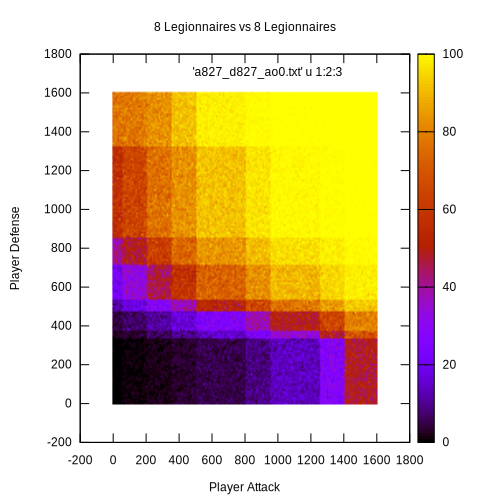
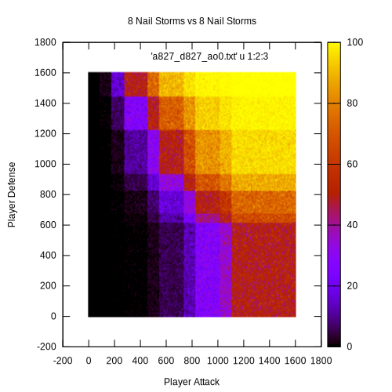

# What is the Forge of Empires battle simulator?

With this simulator, *Auto Battle*s can be done, just like in the online game
[Forge of Empires](https://forgeofempires.com/).

# Why Forge of Empires battle simulator?

Even addicts to the game don't often have an satisfying understanding about the
game's mechanics. Although the AI acts very simple during fights, there a
variaty of factors which may decide the battle. With this simulator, you can
simply tweak some of the factors and try out their impact.

# How does it work?

## Damage Calculation

The damage is calculated from the quotient of attack/defense. The derived
maximum and minimum damage are based on the [empirical
data](https://youtu.be/ksX0w1h4-4U?t=25) given in
[FoEhints](https://www.youtube.com/channel/UCSHayi0U1WT1L_YPpuriZag), which
confirms some older [forum
message](https://forum.en.forgeofempires.com/index.php?threads/the-damage-calculator.25048/).
The attack and defense are calculated from the unit's raw attack, its bonus
against the opponents' unit type and the player's attack bonus. The resulting
maximum/minimum damage are multiplied by 1.5 in case of a [critical
hit](https://forgeofempires.fandom.com/wiki/Arctic_Orangery#Critical_Hit). The
damage is then randomly chosen among all possible values.

## Movement and Battle Field

Units are moving on a one dimensional scale, one player's units are all
starting at `-7`, the other one's are starting at `7`. If no opponent is in
range, the unit moves forward as far as possible. By default, the moving cost
is always 3 per tile, i.e. [planes are assumed with a movement cost of
1.5](https://forgeofempires.fandom.com/wiki/Movement_Cost). Terrains are not
implemented, so that terrain based attack/defense or stealth are not
considered.

## Available Units

- [x] [Rogue](https://forgeofempires.fandom.com/wiki/Rogue)
- [x] [Legionnaire](https://forgeofempires.fandom.com/wiki/Legionnaire)
- [x] [Steel Warden](https://forgeofempires.fandom.com/wiki/Steel_Warden)
- [x] [Nail Storm](https://forgeofempires.fandom.com/wiki/Nail_Storm)
- [x] [Energy Cannon](https://forgeofempires.fandom.com/wiki/Energy_Cannon)

## Available Unit Skills

- [x] [Secret Identity](https://forgeofempires.fandom.com/wiki/Secret_Identity)
- [x] [Keen Eye](https://forgeofempires.fandom.com/wiki/Keen_Eye)
- [x] [Force Field](https://forgeofempires.fandom.com/wiki/Force_Field)
- [x] [Rapid Deployment](https://forgeofempires.fandom.com/wiki/Rapid_Deployment)

## Examples

In [examples](examples) you can find some match-ups, to show the impact of the
player's attack/defense boost or the impact of some unit skills, such as the
rogue's secret identity. The resulting data can be plotted with
[Gnuplot](http://www.gnuplot.info/).

### 8 Legionnaires vs. 8 Legionnaires

The plot shows the number of wins for an opponent with 827 attack/defense
(attrition 63). The edges in the hot squares are marking the spots where the
boost is big enough to deal more additional (minimum/maximum) damage. For
Legionnaires, a defense boost is quite effective, because its basic defense is
60% higher than its attack.

### 8 Nail Storms vs. 8 Nail Storms

Again, the plot shows the number of wins for an opponent with 827
attack/defense (attrition 63). Compared with the 8 Legionnaires, we see that
attack and defense boost have a similar impact (the basic attack/defense Nail
Storms is identical). But, even for a very high attack/defense boost, there's
still some chance of loosing the fight. This is due to the skill keen eye,
which may favor the presumably weaker opponent in some battles.
